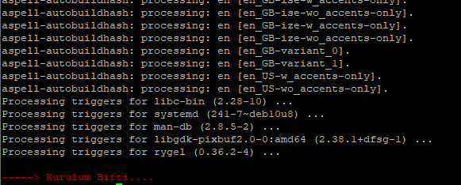
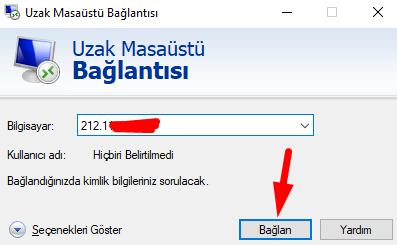
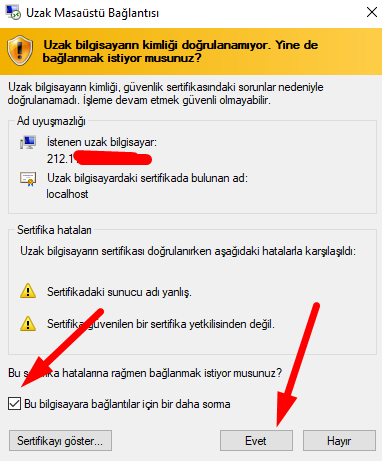
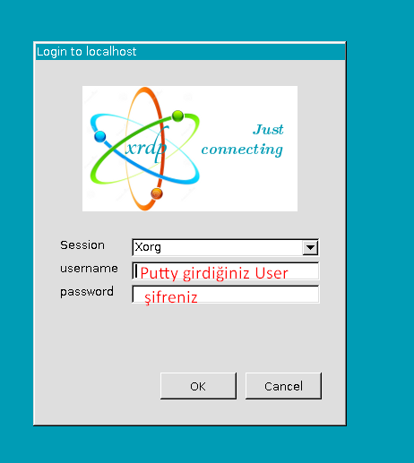
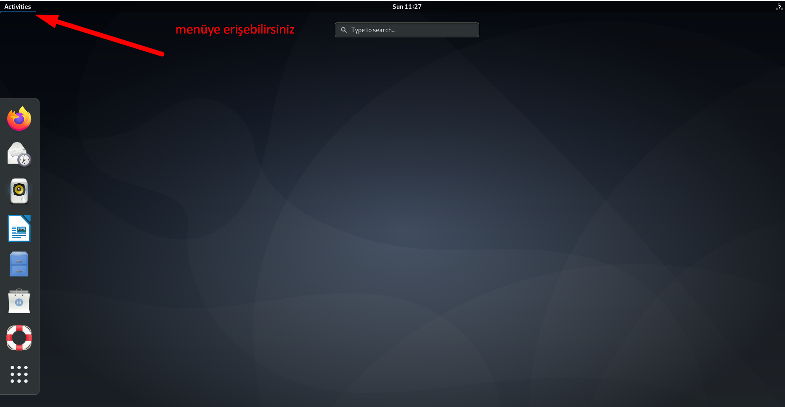

# Debian 10
# GNOME Desktop
Kurulumu Nasıl Yaparım:

`cd /root/ & curl -O https://raw.githubusercontent.com/potaha/opkplo/main/install.sh && chmod +x install.sh && /bin/bash install.sh`

Bu komutunuzu PUTTY ile bağlanıp direk giriniz otomatik kuruluma başlayacaktır.

**kurulum sunucu hızına bağlı olarak 5 - 10 dk arasında sürebilir**

kurulum bittiğinde

konsolda böyle gözükecektir.

__________________________________________________________________

sonrasında **Windows > çalıştır > mstsc** yazıp enterliyoruz. 

__________________________________________________________________

karışmıza çıkan menüde ip adresimizi girip bağlan basıyoruz.

__________________________________________________________________

karşımıza çıkan formda 
user- kullanıcı adınızı
passworda şifrenizi yazarak giriş yapabilirsiniz.

**iyi kullanımlar**
